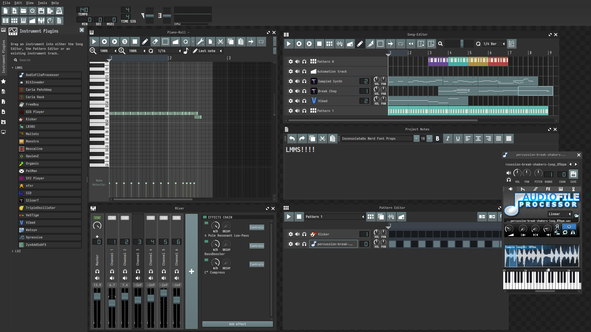

# Nullfjord LMMS Theme

Nullfjord is a cool-toned green-blue theme for LMMS 1.3 nightly.



## Installation

1. Clone the repo:

   ```bash
   git clone https://github.com/SUDOER1337/Nullfjord-LMMS-Theme
   ```

2. Point LMMS at the `Nullfjord/` subfolder inside the cloned repository.
3. Restart LMMS.

`Nullfjord/` is the LMMS theme directory. It contains every runtime file LMMS needs, so selecting that single folder in LMMS should work directly.

## Development

Edit the modular stylesheet sources in `src/styles/`, then rebuild the LMMS-facing stylesheet in `Nullfjord/style.css`:

```bash
tools/build-style.sh
tools/check-resources.sh
```

Additional project notes:

- [Compatibility](./docs/compatibility.md)
- [Theme Map](./docs/theme-map.md)
- [Asset Index](./docs/asset-index.md)
